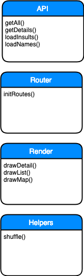
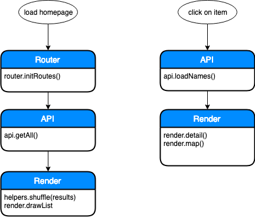

# Web app from scratch minor webdev 18-19

## Description

I made a web app from scratch that displays a list of insult possibilities. It combines the randomuser API and the trumpquotes API into a well thought out personal insult.

## Interaction

The user finds a list of possible insults on the homepage (name + insult). After clicking on the desired sentence they will be able to look at a more detailed overview about the insultee. This overview states the e-mail, phone number and location (using the google maps API) to highlight the different ways to contact this person.

## Actor diagram

My app has four main actors:

- the API, handling API get requests
- the Router, which handles the routing (surprise)
- the Render actor, rendering the retrieved data into a HTML template
- Helpers, which for now only contains one helper function; shuffle (shuffles an array to place its content on random indexes)

## Interaction Diagram

Below you will see the main interaction flows of the app, on load and when clicking on an insult.

## Sources

I used the following javascript to sanitize my innerhtml input to prevent Cross Site Scripting:

https://gomakethings.com/a-safer-alternative-to-innerhtml-with-vanilla-js/
