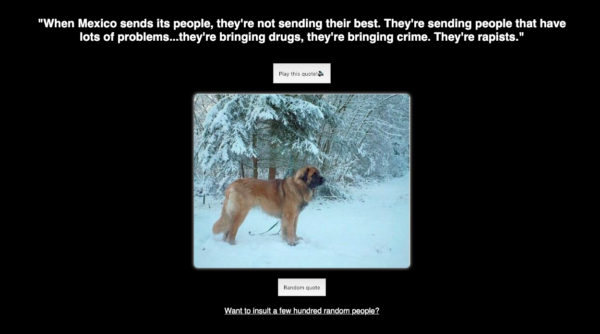

# Week 2

## Link to live demo

[Demo](https://joostflick.github.io/web-app-from-scratch-18-19/week1/)

## Wat doet deze app

De app combineert een willekeurige Trump quote met een willekeurige foto van een hond. Ook kan er naar een lijst van honderden mogelijke beledigingen gekeken worden. Daarbij worden willekeurige namen gecombineerd met willekeurige beledigingen voor die persoon.

## De gebruikte API's

Trump quotes:
https://api.whatdoestrumpthink.com/api/v1/quotes

Beperkingen: Weinig data, alleen algemene quotes / gepersonaliseerde quotes

Random dog images:
https://dog.ceo/api/breeds/image/random/

Beperkingen: Maximaal 50 random afbeeldingen opvragen

Random users:
https://randomuser.me/api/

Voor de eerste pagina (quote + afbeelding) heb ik synchrone get requests gedaan voor de afbeelding en de quote. Voor de lijstweergave heb ik het wat schaalbaarder gemaakt door verschillende requests met Promises op te lossen.

## Interactie

Knop om een nieuwe quote + hondenfoto aan te vragen, knop voor text to speech bij de quotes.
De gebruiker kan heen en weer navigeren tussen de lijst weergave en de quote generator.

## Wishlist

- templating engine
- een use case voor deze applicatie
